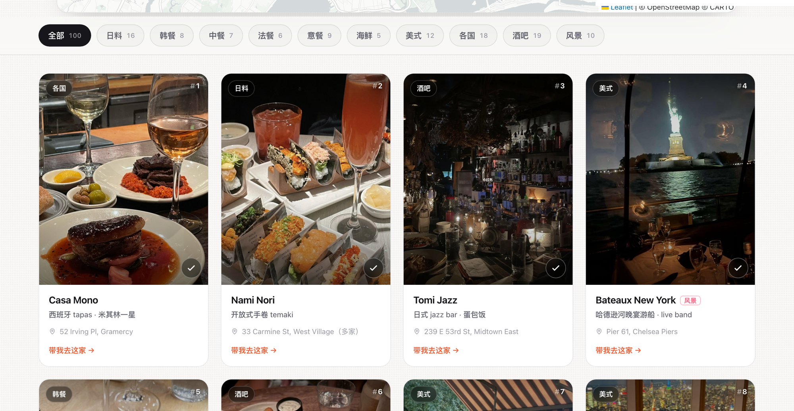

<div align="center">

# 🍜 City Food Guide

### 把你的私藏餐厅清单，变成一个美到想截图分享的网站。
### Turn your list of favorite restaurants into a site people *screenshot and share*.

**一个 `guide.json` 文件 → 一个双语、可打卡、能导航、能晒成绩的城市好吃榜。**
*One JSON file → a bilingual, check-in-able, map-powered city food guide.*

[**🔴 看真实例子 · See it live →**](https://skylar-nyc-100.netlify.app) &nbsp;·&nbsp; [**⚡ 3 步开始 · Quick start ↓**](#-3-步拥有你自己的好吃榜--make-it-yours-in-3-steps)

<a href="https://skylar-nyc-100.netlify.app"></a>

*↑ 真实例子「Skylar's NYC 100」：按菜系筛选的照片墙，每家店可一键打卡。Fork 一下，30 分钟内换成你的城市。*

<sub><a href="assets/demo.png">📸 看完整长截图 · See the full-page screenshot</a> &nbsp;·&nbsp; <a href="assets/demo.gif">🎬 看动图演示 · Watch the animated demo</a></sub>

</div>

---

## 😍 为什么你会想要它 · Why you'll want this

你已经吃遍了一座城市。朋友总在问「有什么推荐」。
你不想再发一长串干巴巴的文字 —— 你想发一个**链接**，让人点开就「哇」。

> You've eaten your way through a city. Friends keep asking "where should I go?"
> Stop pasting a wall of text. Send them **one link** that makes them go *whoa*.

这个仓库就是那个链接背后的引擎。它帮你白嫖到：

| | |
|---|---|
| 📸 **照片墙** | 你的店，铺成一面可按菜系筛选、能搜索的精致照片墙 |
| ✅ **打卡进度** | 访客能勾选「我去过」，自动算分 —— 像游戏一样上瘾 |
| 🎴 **一键晒成绩** | 自动生成精美分享卡 + 文案 + 话题标签，直接发小红书 / IG / 抖音 |
| 🗺️ **互动地图** | 100 家店按菜系上色的 Leaflet 地图，点开图钉直接导航 |
| 📧 **收邮箱** | 内置 beehiiv 订阅框 —— 把流量变成你自己的粉丝 |
| 🔓 **订阅即解锁** | 填完邮箱网页**立刻**弹出 Google 地图 + PDF 福利,无需付费邮件自动化,零成本秒交付 |
| ☕ **「请我喝咖啡」彩蛋** | 一个打赏按钮,点了发现是「逗你玩的,关注我就好啦」——直接跳小红书涨粉 |
| 🌏 **中英双语** | 一键切换，老外朋友也看得懂 |
| 📄 **离线 PDF + 谷歌地图** | 一条命令导出，当作 newsletter 的引流福利 |

**全部是单文件静态网页，零依赖、零后端、免费部署。** Push 到 Netlify / Vercel / GitHub Pages 就上线。

---

## 🙋 这是给谁的 · Who it's for

- 🍴 **探店博主 / Food creators** — 把你的小红书探店变成一个可沉淀、可涨粉的「作品集」网站。
- 📰 **Newsletter 主理人** — 用「导航地图 + PDF」当订阅福利，把读者变成邮箱粉丝。
- 👯 **任何想分享的人** — 给来你城市玩的朋友发一个链接，比发 20 条语音强。
- 🏙️ **本地生活账号** — "Tokyo 100"、"LA 100"、"上海咖啡 50"… 换数据就是新一座城。

---

## ⚡ 3 步拥有你自己的好吃榜 · Make it yours in 3 steps

```bash
# 1️⃣ Fork & clone，然后从模板开始
cp examples/starter.json guide.json     # 填进你的店：店名、菜系、地址、照片名

# 2️⃣ 自动定位 + 生成网站
pip install pillow numpy
python3 scripts/geocode.py     guide.json --city "Your City"   # 自动补经纬度
python3 scripts/build_guide.py guide.json dist/                # → dist/index.html

# 3️⃣ 放照片，预览，上线
#    把照片丢进 dist/images/（每家店一张 <名字>.png）
python3 scripts/trim_borders.py dist/images        # 自动裁掉照片黑边/白边
python3 -m http.server -d dist 4318                # 打开 localhost:4318 预览 🎉
```

想要导航地图和 PDF 福利？再两条命令：

```bash
python3 scripts/make_mymaps.py guide.json dist/my-maps.csv     # 导入 mymaps.google.com
python3 scripts/make_pdf.py    dist/index.html dist/guide.pdf  # 离线 PDF 清单
```

📖 完整数据格式、每个脚本、避坑指南都在 [**`SKILL.md`**](SKILL.md)。
🤖 用 Claude Code？这是个现成的 **skill** —— 直接说「帮我建一个城市好吃榜」就行。

---

## 🧩 一个 JSON 长什么样 · What the data looks like

```jsonc
{
  "config": { "site_title": "My City 100", "brand_sub": "· 我的好吃榜",
              "mymaps_url": "…", "pdf_url": "…", "xhs_url": "…",
              "...": "品牌 / 福利链接 / 社交账号" },
  "venues": [
    { "name": "Sushi Blossoms", "type": "寿司 · Omakase", "group": "日料",
      "addr": "334 8th Ave, Chelsea", "img": "sushi-blossoms",
      "featured_rank": 3, "lat": 40.7474, "lng": -73.9968 }
  ]
}
```

就这么简单 —— 加一家店，就多一行。 *Add a restaurant? Add a line.*

---

## 📦 仓库内容 · What's in the box

```
template/guide.template.html   通用单文件网站引擎（改这里换布局/配色）
scripts/build_guide.py         guide.json → dist/index.html
scripts/trim_borders.py        自动裁掉照片的黑边 / IG 故事白边
scripts/geocode.py             用 OpenStreetMap 自动补经纬度
scripts/make_mymaps.py         导出 Google My Maps CSV
scripts/make_pdf.py            导出离线 PDF 引流福利
assets/welcome-email.template.md   双语 beehiiv 欢迎邮件模板
examples/starter.json          空白模板（你从这里开始）
examples/nyc-100.json          完整范例：真实的 100 家纽约餐厅
```

照片和构建产物默认 `.gitignore` —— 带上你自己的图就好。

> 💡 `examples/nyc-100.json` 不是玩具数据 —— 它就是线上真实站点 [**skylarnyc.com**](https://skylarnyc.com) 背后的完整数据集。*It's the real dataset powering the live production site.*

---

<div align="center">

### ⭐ 觉得有用？给个 Star，Fork 一份，做出你的城市。
### Like it? Star it, fork it, and build your city.

由 [**Skylar's NYC 100**](https://skylar-nyc-100.netlify.app) 提炼而来 · MIT License · PRs welcome 🍣

</div>

---

## 🛰 更多来自 Skylar · More from Skylar

- [**ANSIO**](https://github.com/SkylarWJY/ANSIO-conversational) — 创作者的对话式增长引擎 · the first conversational growth engineer for creators
- [**skylarnyc.com**](https://skylarnyc.com) — 本引擎驱动的线上站点「纽约约会 100 家」· the live site built with this engine
- 更多项目 · More → [github.com/SkylarWJY](https://github.com/SkylarWJY)
