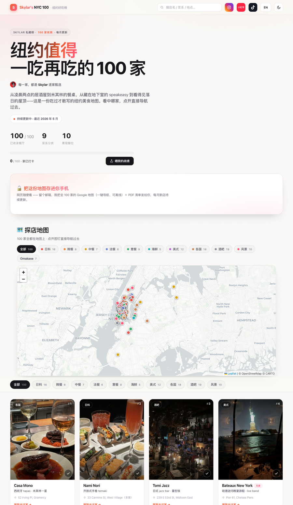

# City Food Guide builder

Turn a curated restaurant list into a polished, shareable, bilingual guide site —
the engine behind *Skylar's NYC 100*. Everything is driven by **one `guide.json`**
(config + venues); the HTML template is generic, so the same pipeline re-skins to
any city ("Tokyo 100", "LA 100") by swapping the data file and the photos.

## What you get

A static, dependency-free `index.html` with:
- **Filterable photo grid** of venues, by cuisine group, with search.
- **Check-in tracker** ("打卡进度") persisted in localStorage + a score share-card.
- **Per-venue + per-score share cards** rendered on a `<canvas>`, with auto-copied
  captions/hashtags and a desktop share dialog (mobile uses the native share sheet).
- **Interactive Leaflet map** with cuisine-colored pins (only venues that have
  lat/lng appear).
- **Email-capture gate** via an embedded beehiiv subscribe form.
- **Instant lead-magnet delivery** — after subscribing, beehiiv redirects back with a
  `?sub_id=…`; the page latches that into localStorage (and cleans the URL), then swaps the
  signup form for an "unlocked" panel linking the Google My Maps (`mymaps_url`) + PDF
  (`pdf_url`). No paid beehiiv automation needed — the value lands on-page, instantly.
- **"Buy me a coffee" follow gag** — a tip button that, on click, flips to a playful
  "just kidding — follow me ❤️" and opens your 小红书 (`xhs_url`). Degrades to a plain link
  without JS.
- **End-cap CTA tile** that fills the orphaned last grid cell.
- **SEO + GEO baked in** — the build injects schema.org JSON-LD (`ItemList` + a
  `Restaurant` per venue with cuisine/address/geo) so the venue data is machine-readable
  even though the grid is JS-rendered (most AI crawlers don't run JS). It also emits
  `robots.txt` (explicitly allowing GPTBot/PerplexityBot/ClaudeBot/Google-Extended so you
  can be cited by answer engines), `sitemap.xml`, and `llms.txt`.



## The data model — `guide.json`

```jsonc
{
  "config": {
    "site_title":       "Skylar's NYC 100 · 纽约好吃榜",  // <title> + OG/Twitter
    "brand_wordmark":   "<em>Skylar's</em> NYC 100",       // nav logo (HTML ok)
    "brand_sub":        "· 纽约好吃榜",
    "site_url":         "https://skylar-nyc-100.netlify.app/",
    "og_image":         "https://skylar-nyc-100.netlify.app/og.png",
    "site_display_url": "skylar-nyc-100.netlify.app",       // printed on share cards
    "share_link":       "https://skylar-nyc-100.netlify.app",
    "beehiiv_form_id":  "460499a5-…",                       // embedded subscribe form
    "ig_url": "https://instagram.com/skylarwjy", "ig_handle": "@skylarwjy",
    "xhs_url": "https://xhslink.com/m/…", "xhs_handle": "@Skylar创业版",  // xhs_url = "buy me a coffee" target
    "mymaps_url": "https://www.google.com/maps/d/viewer?mid=…",  // unlocked after subscribe
    "pdf_url": "Skylar-NYC-100.pdf",                            // unlocked after subscribe (site-root path or full URL)
    "locality": "New York", "region": "NY", "country": "US",    // optional — enriches the JSON-LD addresses
    "caption_brand_zh": "Skylar 私藏纽约好吃榜",
    "caption_brand_en": "Skylar's NYC 100",
    "groups": [ {"zh":"全部","en":"All"}, {"zh":"日料","en":"Japanese"}, … ]
  },
  "venues": [
    { "name":"Sushi Blossoms", "type":"寿司 · Omakase", "type_en":"Sushi · Omakase",
      "group":"日料", "addr":"334 8th Ave, Chelsea", "img":"IMG_5988",
      "extra_imgs":["IMG_5988b"], "featured_rank":3, "lat":40.7474, "lng":-73.9968,
      "view":1 }
  ]
}
```

Per-venue: `name` `type` `group` `addr` `img` are required; `type_en` `extra_imgs`
`featured_rank` (lower = nearer the top) `lat`/`lng` (omit to drop the map pin)
`view` (badge) are optional. `name` is also the image-map key. `group` must match a
`config.groups[].zh`. Photos live in `dist/images/.png`.

## Pipeline — typical run

```bash
# 0. (new city) start from the skeleton, or reuse examples/nyc-100.json
cp examples/starter.json guide.json        # then edit venues + config

# 1. fill missing coordinates (OpenStreetMap; safe to re-run, caches results)
python3 scripts/geocode.py guide.json --city "New York"

# 2. build the site -> dist/index.html
python3 scripts/build_guide.py guide.json dist/

# 3. drop photos into dist/images/  (one <name>.png per venue, matching "img")
#    then peel any letterbox / IG-story bands off the card photos:
python3 scripts/trim_borders.py dist/images           # add --dry-run to preview

# 4. exports
python3 scripts/make_mymaps.py guide.json dist/my-maps.csv   # import at mymaps.google.com
python3 scripts/make_pdf.py    dist/index.html dist/guide.pdf # offline lead magnet

# 5. welcome email: fill assets/welcome-email.template.md and paste into beehiiv
```

Preview locally with `python3 -m http.server -d dist 4318` then open
`http://localhost:4318`.

## Scripts

| script | does |
|---|---|
| `build_guide.py` | `guide.json` → `dist/index.html` (injects data into the template) |
| `trim_borders.py` | strips uniform/black borders off card photos (pillow + numpy) |
| `geocode.py` | fills missing `lat`/`lng` via Nominatim, writes back to `guide.json` |
| `make_mymaps.py` | `guide.json` → Google My Maps import CSV |
| `make_pdf.py` | `dist/index.html` → PDF via headless Chrome |
| `_extract_template.py` | dev-only: regenerate the template from a working master HTML |
| `_nyc_to_json.js` | dev-only: lift an inline-data master HTML into a `guide.json` |

## Notes & gotchas

- **Dependencies:** `pillow`, `numpy` (image trim); `requests` not required (geocode
  uses stdlib urllib); **Google Chrome** for `make_pdf.py`. No build step for the site.
- **PDF size:** `make_pdf.py` embeds the photos at full resolution — downscale photos
  (≤1600px long edge) before rendering or the PDF balloons to 100MB+.
- **beehiiv welcome email** is configured server-side in beehiiv (Automations /
  Settings → Welcome Email), *not* in the page. The form only captures the signup.
- **Geocoding** lands a few pins on the wrong address — always eyeball the map and
  hand-fix stray `lat`/`lng` in `guide.json`.
- **Re-skinning:** the template is fully parameterized (brand, URLs, social handles,
  captions, cuisine groups). To change layout/colors, edit
  `template/guide.template.html` directly — it's a single self-contained file.
- **Deploy:** any static host. The reference site deploys to Netlify
  (`netlify deploy --prod` from the `dist/` folder). Don't commit photos — they're
  `.gitignore`d.
